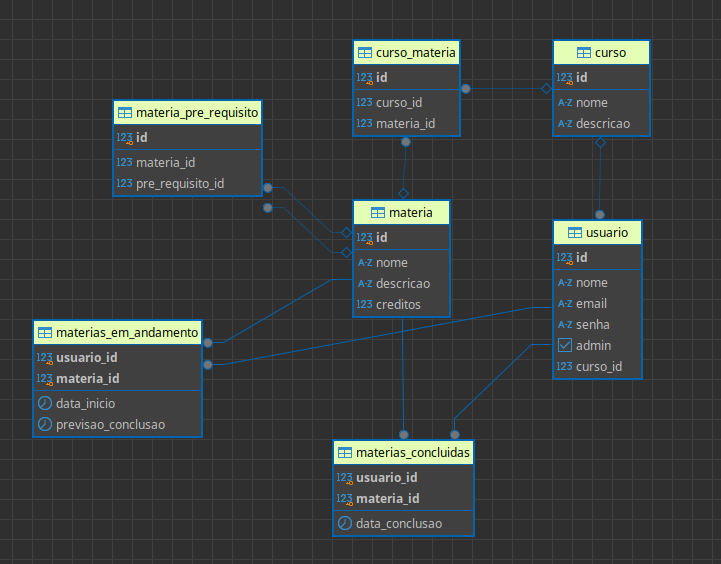

# AcadPlanner

AcadPlanner é um sistema projetado para ajudar estudantes universitários a organizarem suas disciplinas e identificarem quais matérias podem ser cursadas com base no curso escolhido e nos pré-requisitos já cumpridos.

## Funcionalidades

- **Cadastro de cursos e matérias**: Somente o administrador pode cadastrar ou gerenciar cursos e matérias.
- **Gestão de usuários**: Alunos podem se registrar, escolher seu curso e acompanhar seu progresso.
- **Sugestão de disciplinas**: O sistema apresenta as matérias disponíveis para cursar com base nos pré-requisitos cumpridos.
- **Controle de progresso**: Registro de matérias em andamento e já concluídas pelos alunos.
- **Roadmap**: Gerar roadmap de estudos de uma máteria passando o tempo(semanas, dias) que você precisar para dominar-la(USO API OPENAI).


## Requisitos

- **Java**: Versão 17 ou superior.
- **Spring Boot**: Versão 3.x.
- **PostgreSQL**: Banco de dados relacional utilizado para persistência.
- **Docker** (opcional): Para configurar o ambiente de banco de dados rapidamente.

## Instalação

1. Clone o repositório:
   ```bash
   git clone https://github.com/seu-usuario/AcadPlanner.git
   cd AcadPlanner
   ```

2. Configure o banco de dados PostgreSQL:
    - Use um arquivo `docker-compose.yml` para subir o banco:
      ```bash
      docker-compose up -d
      ```

3. Compile e execute o projeto:
   ```bash
   ./mvnw spring-boot:run
   ```

4. Acesse o sistema no navegador:
    - URL padrão: [http://localhost:8080](http://localhost:8080)

## Estrutura do Banco de Dados

Veja abaixo o diagrama Entidade-Relacionamento (ER) do banco de dados:



